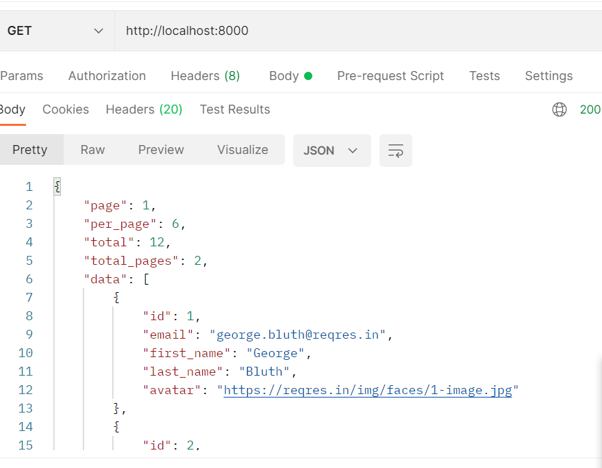

# host transformer plugin (Kong)

Dockerfile - для внесения go-кода в образ конга

docker-compose - запуск postgres и kong вместе

kong-transformer.go - код плагина.

## Процесс тестирования плагина

Создаем сервис и роут (/bash/create.sh)

Отправляем запрос на localhost:8001 (KONG_ADMIN), убеждаемся что плагин доступен для использования.

Проверяем, что сервис и роут созданы.

Проверим, что роут api/users?page=2 созданного сервиса возвращает ответ. Для этого воспользуемся  localhost:8000 (KONG_PROXY) 

Теперь создадим плагин kong-transformer для нашего сервиса

Вновь проверим ответ роута с помощью KONG_PROXY

Поскольку у petstore.swagger.io:443 нет роута api/users должно вернуть 404.
